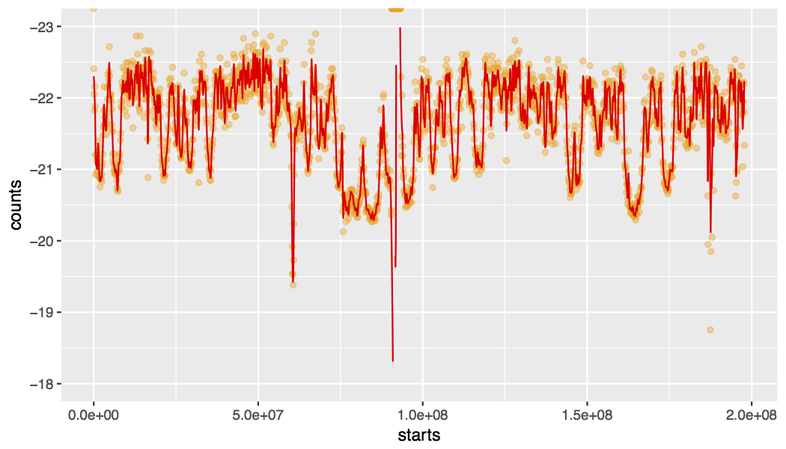
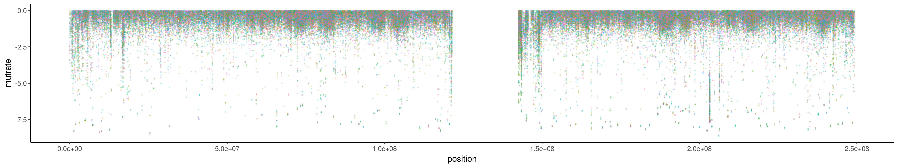
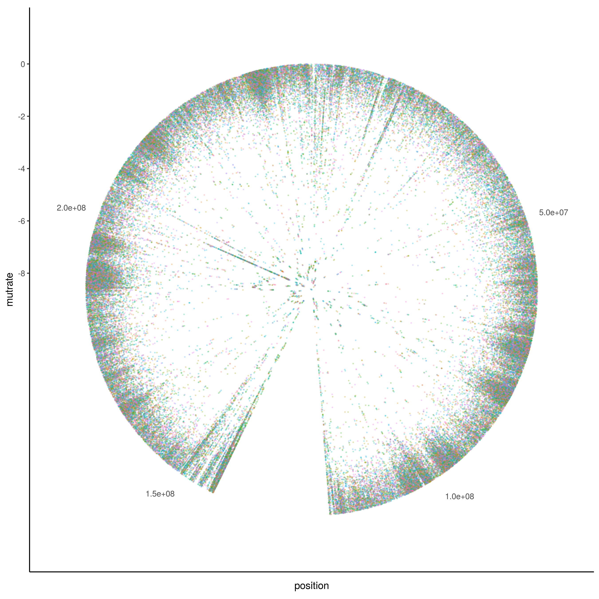
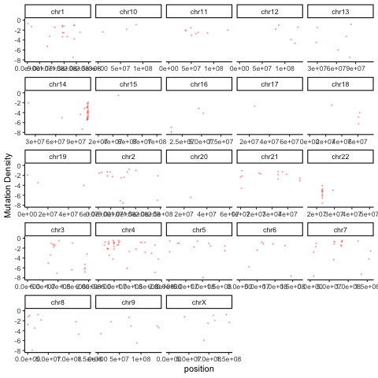

# Rainstorm and D:droplet:ppler 
## A toolkit to identify regions of the genome enriched for mutations from large sets of cancer genomes
### _Please be aware that this repository is under active development_

We have implemented a multi-patient extension of the rainfall plot concept that we named a rainstorm plot. There is a fairly complicated set of pre-processing steps to help mitigate a variety of issues that are encountered when trying to plot more than one patient rainfall plot on one image. Our calculation also adjusts for local variation in mutation rate that can be observed at the level of the entire cohort. The preprocessing is all accomplished by ```rainstorm.R```, which pre-processes the data and allows plots to be generated and ```rainstorm_peaks.R``` can be used, if desired, to use our Doppler algorithm to search for peaks of mutations within the data. 

## Dependencies
The following R packages are needed by these tools:
```argparse```, ```GenomicRanges```, ```ggplot2```, ```maftools```, ```MassSpecWavelet```, ```parallel```

## rainstorm.R 
This script takes a MAF file containing genome-wide mutations from many cancer genomes and determines the background mutation rate using the whole cohort. Then, one chromosome at a time, a patient-by-patient calculation similar to the rainfall plot calculation is used to infer the distance between each mutation and mutations in other genomes in the same cohort. The first time a data set is analyzed, the script will calculate the local background mutation rate for each chromosome using, by default, 100 kb windows. An example of the local mutation rate across chromosome 3 is plotted by default. For a non-Hodgkin lymphoma cohort, the result looks like this:




```
usage: ./rainstorm.R [-h] [--input_maf INPUT_MAF]
                     [--output_base_name OUTPUT_BASE_NAME] [--cpu_num CPU_NUM]
                     [--genome_fai GENOME_FAI] [--plot PLOT]
                     [--max_mut MAX_MUT] [--off_by OFF_BY]
                     [--calc_background CALC_BACKGROUND]

Calculate rainstorm intermutation distance values for all mutations in a large
set of cancer genomes

optional arguments:
  -h, --help            show this help message and exit
  --input_maf INPUT_MAF, --m INPUT_MAF
                        MAF file containing mutation calls from many patient
                        genomes
  --output_base_name OUTPUT_BASE_NAME, --o OUTPUT_BASE_NAME
                        specify a base file name prefix for all outputs
  --cpu_num CPU_NUM, -c CPU_NUM
                        set to number of CPUs you would like to use to perform
                        calculation in parallel (consumes lots of RAM)
  --genome_fai GENOME_FAI, --g GENOME_FAI
                        provide the corresponding fasta index for the genome
                        you used. must match the chromosome naming style used
                        in your MAF!
  --plot PLOT, -p PLOT  ploduce rainstorm plot for each chromosome
  --max_mut MAX_MUT, -M MAX_MUT
                        genomes skipped if their total mutation load exceeds
                        this value
  --off_by OFF_BY, -k OFF_BY
                        take mean of the distance to the k closest mutations
                        to determine rainstorm distance value
  --calc_background CALC_BACKGROUND, -b CALC_BACKGROUND
                        if you have done this once for a cohort, you can
                        reload the result in future runs by setting this to 0

```
### Example
```
Rscript ./rainstorm.R --input_maf ./cohort_mutations_merged.maf \
--output_base_name outdir/cohort_out --genome_fai ./hg19.ucsc.fa.fai --cpu_num 12
```
With genomes that have high mutation loads, we strongly recommend running this with as many CPU cores as possible.

## rainstorm_plot.R 
A basic plotting script using ggplot2 to visualize chromosome-wide patterns or specific regions on chromosomes.

```
usage: ./rainstorm_plot.R [-h] [--rainstorm_points RAINSTORM_POINTS]
                          [--xstart XSTART] [--xend XEND]

plot a genomic region with mutations and encode data

optional arguments:
  -h, --help            show this help message and exit
  --rainstorm_points RAINSTORM_POINTS, -r RAINSTORM_POINTS
                        Rainstorm output (points to plot) from a single
                        chromosome
  --xstart XSTART, -s XSTART
                        limit plot to points after this position
  --xend XEND, -e XEND  limit plot to points before this position
```
### Example
```
Rscript ./rainstorm_plot.R --rainstorm_points ./cohort_out_chr3.tsv
```
The default plot will be a linear representation of the chromosome with coordinates on the X axis and the rainstorm value on the Y. The lower values indicate an enrichment of mutations. Each color represents a different patient in the cohort. As such, a diversity of colors in one region suggests a mutation peak that is more prevalent in the cohort. 



Another option to generate a more horizontally compact representation is a circular plot using polar coordinates to represent the chromosomal positions.




## rainstorm_peaks.R
Use the Doppler algorithm to identify regions enriched for mutations across multiple patients (Doppler "peaks").

```
usage: ./rainstorm_peaks.R [-h] [--stringSplit STRINGSPLIT]
                           [--input_maf INPUT_MAF]
                           [--output_base_file OUTPUT_BASE_FILE]
                           input_files [input_files ...]

wavelet searching argument

positional arguments:
  input_files           Input path and files

optional arguments:
  -h, --help            show this help message and exit
  --stringSplit STRINGSPLIT
                        characters before chr# or # in the input file names
  --input_maf INPUT_MAF
                        Input maf path and name
  --output_base_file OUTPUT_BASE_FILE
                        Output path and name base
```

### Example
```
Rscript ./rainstorm_peaks.R --stringSplit mean_ --output_base ./output/mean_ \
 --input_maf ./cohort_mutations_merged.maf \
 ./cohort_out_*tsv 
```
### More visualization options
There are a variety of useful ways to summarize and visualize the Rainstorm output. The R code below uses the output of Doppler (mutations within peaks) and the Rainstorm output to cycle through an animation of the local mutation density in each patient. 

```
library(gganimate)
mutmaf=read.csv("doppler_mutations_patient_detail.tsv",sep="\t",header=1)
ggplot(mutmaf,aes(x=position,y=mutrate,color=patient)) + geom_point(alpha=0.4,size=0.3,show.legend = FALSE) + ylim(-8,0) + theme_classic() + facet_wrap(~chromosome,scales='free_x') + labs(y="Mutation Density") + transition_time(patient.numeric) + ease_aes("linear")
```


### References

[The algorithm is described in detail in Arthur et al. Nature Communications (2018).](https://www.nature.com/articles/s41467-018-06354-3)

### External links
 * [The Morin Laboratory at Simon Fraser University](https://morinlab.github.io/team/)

 * [BC Cancer Agency's Genome Sciences Centre](http://bcgsc.ca/)

 * [Cancer Genomics in Galaxy](https://github.com/morinlab/tools-morinlab)
 
### Contact
rdmorin@sfu.ca
@morinryan (Twitter)
